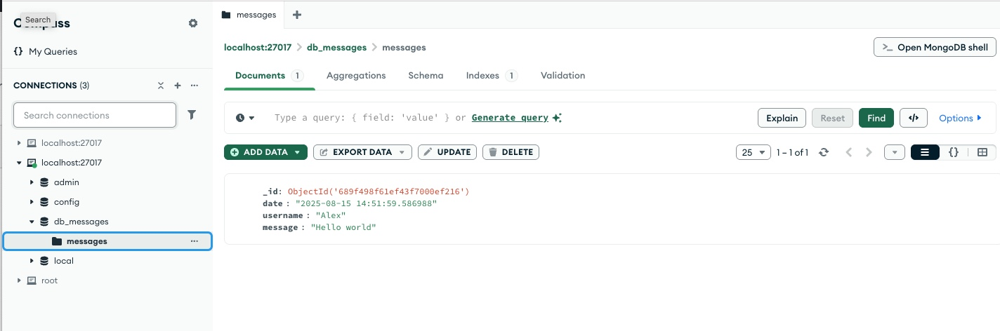

# Web + Socket Server з MongoDB

Простий приклад взаємодії **HTTP-сервера** та **Socket-сервера** з базою **MongoDB**.

- HTTP приймає дані з форми та пересилає їх Socket-серверу.
- Socket-сервер додає час отримання та зберігає повідомлення у MongoDB.

## Формат документа в MongoDB
```json
{
    "date": "2025-08-15 14:20:58.020261",
    "username": "Alex",
    "message": "Hello world"
}
```

## Запуск
```bash
docker compose up --build
```

Відкрити у браузері:  
[http://localhost:3000](http://localhost:3000)

## Приклад даних у базі

